# KaamNow v2 — Architecture & Flow Diagrams

> Open this file in VS Code with the **Markdown Preview** panel to see all diagrams rendered.
> Install the **"Markdown Preview Mermaid Support"** VS Code extension if diagrams don't render.

---

## 1. System Architecture — High Level

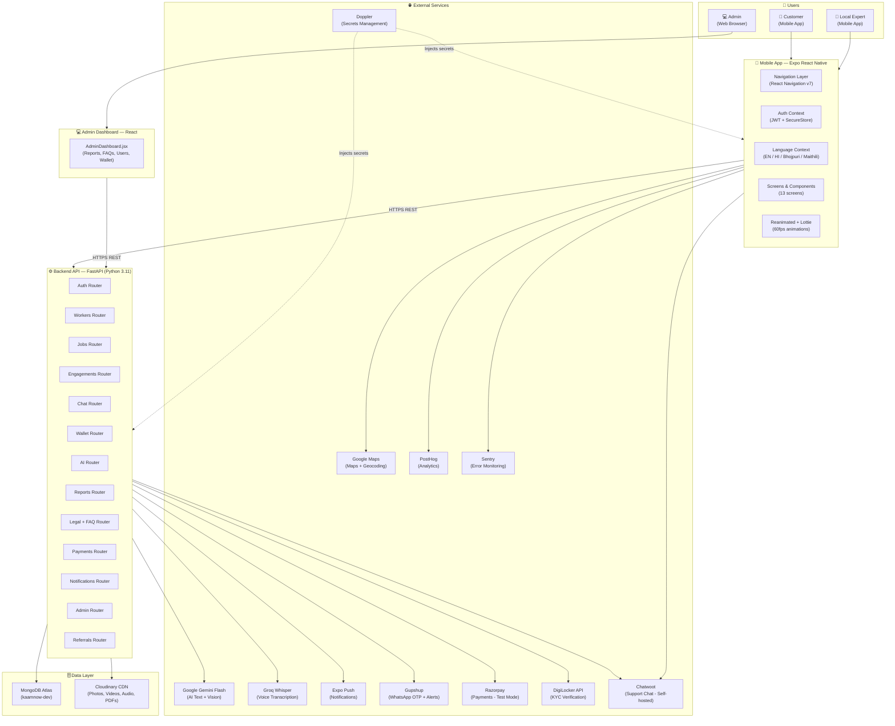

---

## 2. Component Interaction Map

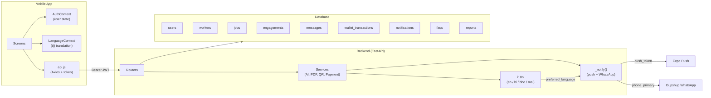

---

## 3. User Signup & Onboarding Flow

```mermaid
flowchart TD
    START(["User opens app"]) --> GUEST["Guest Landing Screen"]
    GUEST --> TAP["Taps 'Join Free'"]
    TAP --> PHONE["Enter phone number\n(+91XXXXXXXXXX)"]
    PHONE --> OTP_SEND["POST /api/auth/send-otp\n→ Gupshup WhatsApp OTP"]
    OTP_SEND --> OTP_ENTER["Enter 6-digit OTP"]
    OTP_ENTER --> OTP_VERIFY["POST /api/auth/verify-otp\n→ returns temp token"]
    OTP_VERIFY --> TERMS["Show T&C screen\n(must scroll + accept)"]
    TERMS --> ACCEPT["POST /api/auth/accept-terms\n→ stores tc_accepted_at"]
    ACCEPT --> NAME["Enter name + gender (optional)"]
    NAME --> SIGNUP["POST /api/auth/signup-complete\n→ is_worker=False, is_customer=True\n→ referral_code generated\n→ wallet_balance=0"]
    SIGNUP --> HOME["Home Screen\n(unified tab bar)"]

    HOME --> WANT_WORK{"Want to\nfind work?"}
    WANT_WORK -->|Yes| BECOME["Tap 'Become a Local Expert'\n(ProfileScreen)"]
    BECOME --> SHEET["BecomeExpertSheet\n3-step bottom sheet"]
    SHEET --> S1["Step 1: Select Skills"]
    S1 --> S2["Step 2: Daily rate + GPS location"]
    S2 --> S3["Step 3: Bio (optional, AI generate)"]
    S3 --> BECOME_API["POST /api/workers/become-worker\n→ users.is_worker = True"]
    BECOME_API --> EXPERT["Now a Local Expert\n(Profile shows worker section)"]
```

---

## 4. Post a Job Flow (with AI)

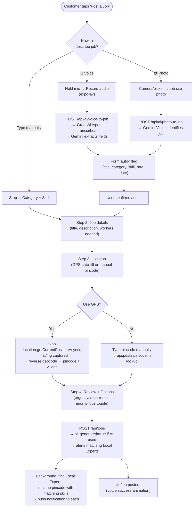

---

## 5. Engagement Lifecycle (Full Flow)

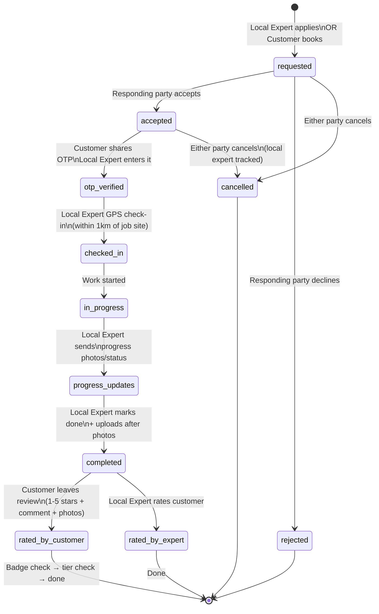

---

## 6. Notification Flow

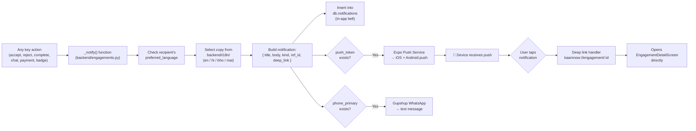

---

## 7. Wallet & Referral Flow

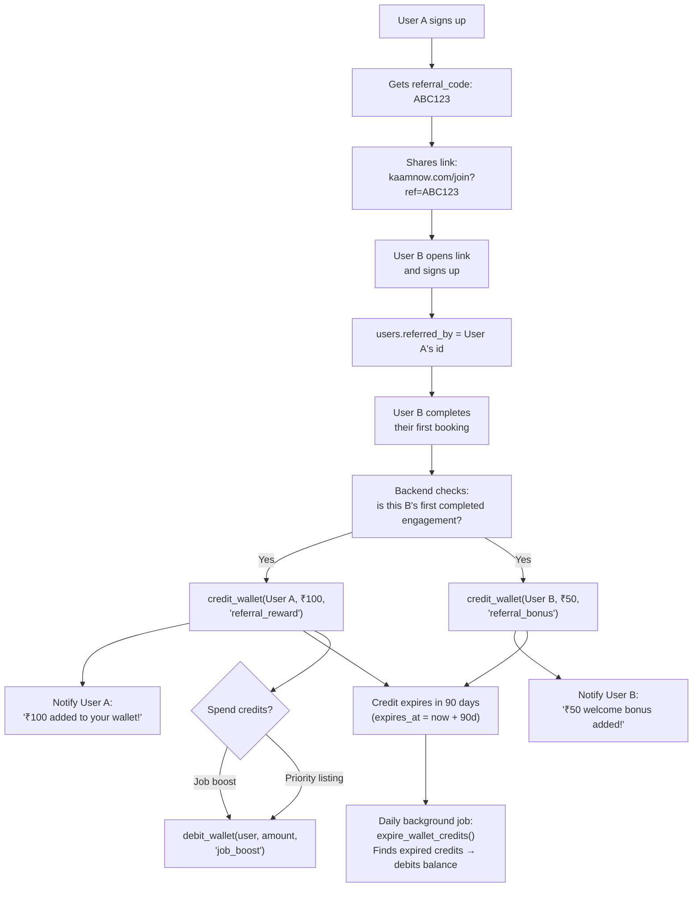

---

## 8. AI Features Flow

```mermaid
flowchart TD
    subgraph VOICE["🎤 Voice-to-Job"]
        V1["User holds mic button\n(expo-av records)"] --> V2["Audio uploaded to\nPOST /api/ai/voice-to-job"]
        V2 --> V3["Groq Whisper\ntranscribes audio → text\n(supports Hindi, Bhojpuri, Maithili)"]
        V3 --> V4["Gemini Flash\nextracts structured fields:\ntitle, category, skill, rate, date"]
        V4 --> V5["Form auto-filled\nUser confirms + posts"]
    end

    subgraph PHOTO["📷 Photo-to-Job"]
        P1["User takes photo of\njob site / broken item"] --> P2["Image uploaded to\nPOST /api/ai/photo-to-job"]
        P2 --> P3["Gemini Flash Vision\nidentifies: what needs doing,\ncategory, suggested skill"]
        P3 --> P4["Form auto-filled\nUser confirms + posts"]
    end

    subgraph CERT["📜 Cert OCR"]
        C1["Local Expert uploads\ncertification image"] --> C2["POST /api/ai/describe-cert"]
        C2 --> C3["Gemini Flash Vision\nreads: cert name, issued by, year, skill"]
        C3 --> C4["Fields auto-filled\nUser confirms + saves"]
    end

    subgraph BIO["✍️ Bio Generator"]
        B1["Local Expert taps\n'Generate my bio'"] --> B2["POST /api/ai/generate-bio\n(skills, rate, jobs, rating, language)"]
        B2 --> B3["Gemini Flash\nwrites 2-sentence bio\nin user's language"]
        B3 --> B4["Bio pre-filled\nUser edits + saves"]
    end
```

---

## 9. Chat Flow

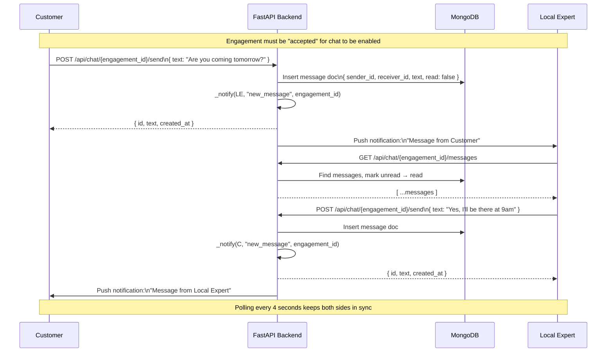

---

## 10. OTP Job Start Flow (Swiggy-style)

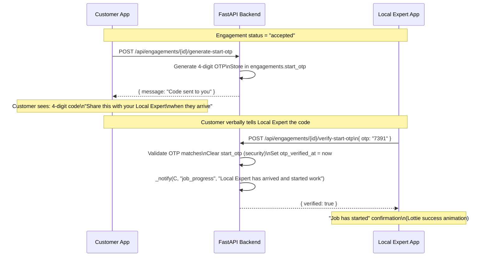

---

## 11. Data Flow — Complete Picture

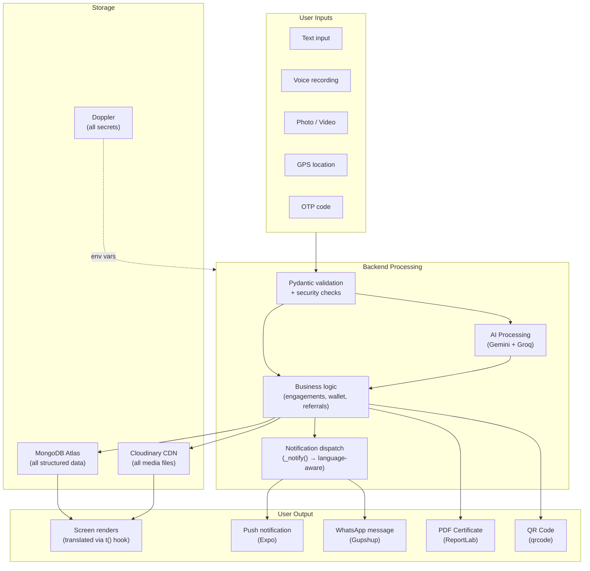

---

## 12. Infrastructure Architecture

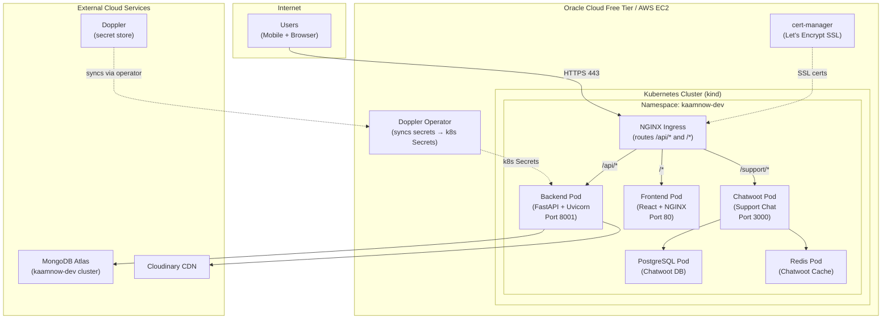

---

## 13. Mobile App Screen Map

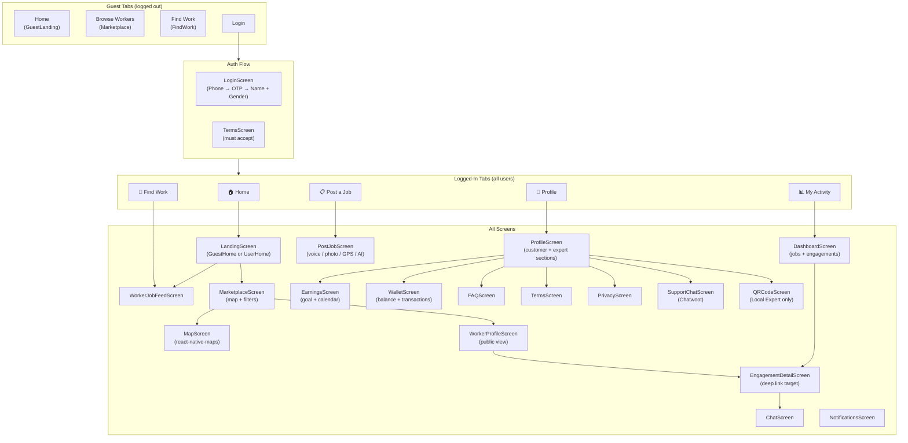

---

*All diagrams render in VS Code with the Markdown Preview Mermaid Support extension.*
*Install: Extensions → search "Markdown Preview Mermaid Support" → Install*
